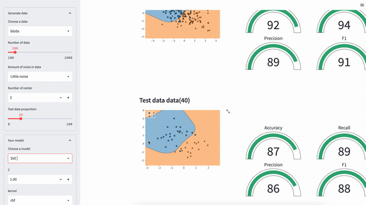

# ML Playground!

In the ML playground, you are able to learn various classification ML algorithms and their hyper-parameters.

   

## How to play with it

1. Choose the dataset
2. Select the model and its hyper-parameters
3. Observe the changing result and learn relationship between hyper-parameters and (overfitting and underfitting).
